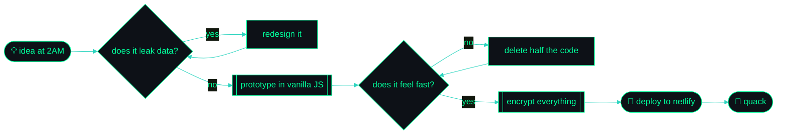

<!--
  ┌──────────────────────────────────────────────────────────────┐
  │  IncognitoQuack — profile README                             │
  │  You're reading the source. Respect. 🦆                       │
  │  Hidden payload: UVVBQ0tfRkxBR3t5b3VfZm91bmRfdGhlX2hpZGRlbl9sYXllcn0=
  └──────────────────────────────────────────────────────────────┘
-->

<div align="center">

<a href="https://github.com/IncognitoQuack">
  
</a>

<a href="https://github.com/IncognitoQuack">
  
</a>

<br/>

<a href="https://github.com/IncognitoQuack?tab=followers"></a>
<a href="https://github.com/IncognitoQuack?tab=repositories"></a>
<a href="https://encryptera.netlify.app"></a>
<a href="https://securecode.netlify.app"></a>


</div>

---

### `~/boot.sh`

```ansi
[0;32m➜[0m  [1;36mincognito@quack[0m:[1;34m~[0m$ ./init --stealth
[0;90m[  OK  ][0m mounting /dev/curiosity
[0;90m[  OK  ][0m loading keypair ........................ [0;32mdone[0m
[0;90m[  OK  ][0m shredding metadata ..................... [0;32mdone[0m
[0;90m[ WARN ][0m caffeine buffer at [0;33m12%[0m
[0;90m[  OK  ][0m spawning 27 repositories ............... [0;32mdone[0m

[1;32m  __
 (o >   [0m[0;37mQUACK. Identity redacted. Code is not.[0m[1;32m
 \\ )
 --"-[0m

[0;32m➜[0m  [1;36mincognito@quack[0m:[1;34m~[0m$ [5m█[0m
```

---

## 🕶️ `cat ./dossier.json`

```jsonc
{
  "alias":     "IncognitoQuack",
  "role":      "Full-stack developer · privacy & security tinkerer",
  "stack":     ["JavaScript", "Node.js", "Socket.io", "HTML/CSS"],
  "obsessions": ["end-to-end encryption", "realtime systems", "clean UX"],
  "shipping":  ["Encryptera", "SecureCode", "SecureChat", "Finance Manager"],
  "philosophy": "The best data you can leak is the data you never stored.",
  "status":    "compiling something you're not supposed to know about"
}
```

<div align="center">


</div>

---

## 🧬 The Arsenal

<div align="center">


</div>

<details>
<summary><b>🔍 Expand: how I actually use each one →</b></summary>

<br/>

| Layer | Weapons | What I ship with it |
|:--|:--|:--|
| **Frontend** | JavaScript · HTML5 · CSS3 · Tailwind | Interfaces that stay out of your way |
| **Backend** | Node.js · Express · Socket.io | Realtime rooms, ephemeral sessions, file relays |
| **Security** | Web Crypto API · AES · hashing · zero-log design | E2E chat, encrypted transfer, secret sharing |
| **Data** | MongoDB · Firebase · localStorage-first | Store the minimum. Forget the rest. |
| **Ops** | Git · GitHub Actions · Netlify · Vercel | Push → build → live in under a minute |

</details>

<details>
<summary><b>🧠 Expand: the mental model I build with →</b></summary>

<br/>



</details>

---

## 📡 Signal Intelligence

<div align="center">


<br/>


<br/><br/>


<br/>


</div>

---

## 🛰️ Declassified Projects

<div align="center">

<a href="https://github.com/IncognitoQuack/SecureChat">
  
</a>
<a href="https://github.com/IncognitoQuack/Extensions">
  
</a>
<a href="https://github.com/IncognitoQuack/Finance-Manager">
  
</a>
<a href="https://github.com/IncognitoQuack/File-sharing">
  
</a>

</div>

<details>
<summary><b>🗂️ Expand the full case file →</b></summary>

<br/>

| # | Project | Classification | Payload |
|:-:|:--|:--|:--|
| 01 | **[SecureChat](https://github.com/IncognitoQuack/SecureChat)** | `realtime · e2e` | Anonymous rooms with unique join codes, end-to-end encrypted, nothing persisted. Node + Socket.io. |
| 02 | **[Extensions](https://github.com/IncognitoQuack/Extensions)** | `browser · tooling` | **ElabXCS** — a browser extension that makes Elab actually bearable. |
| 03 | **[File-sharing](https://github.com/IncognitoQuack/File-sharing)** | `transfer` | Direct, no-account file relay between users. Node backend, dead-simple front end. |
| 04 | **[Finance-Manager](https://github.com/IncognitoQuack/Finance-Manager)** | `tooling · local-first` | Track money without handing it to a third party. |
| 05 | **[Random-Projects](https://github.com/IncognitoQuack/Random-Projects)** | `sandbox` | The lab. Experiments, prototypes, half-ideas that sometimes graduate. |
| 06 | **[Research-Paper](https://github.com/IncognitoQuack/Research-Paper)** | `archive` | Open-access collection of papers worth actually reading. |

**Live deployments**
- 🔐 [`encryptera.netlify.app`](https://encryptera.netlify.app) — encryption playground
- 🧪 [`securecode.netlify.app`](https://securecode.netlify.app) — secure code utilities

</details>

---

## 🐍 The Snake Ate My Contributions

<div align="center">

<picture>
  <source media="(prefers-color-scheme: dark)" srcset="https://raw.githubusercontent.com/IncognitoQuack/IncognitoQuack/output/github-snake-dark.svg" />
  <source media="(prefers-color-scheme: light)" srcset="https://raw.githubusercontent.com/IncognitoQuack/IncognitoQuack/output/github-snake.svg" />
  
</picture>

</div>

> [!NOTE]
> This renders once the included GitHub Action runs. Setup instructions are at the bottom of this file.

---

## 🧩 Interactive Zone

<details>
<summary><b>🔓 Terminal challenge — decode this →</b></summary>

<br/>

```bash
$ echo "UVVBQ0tfRkxBR3t5b3VfZm91bmRfdGhlX2hpZGRlbl9sYXllcn0=" | base64 -d
```

Run it. If you get the flag, [open an issue titled `QUACK`](https://github.com/IncognitoQuack/IncognitoQuack/issues/new?title=QUACK&body=I%20decoded%20it.%20Flag%3A%20) and I'll follow you back. Seriously.

</details>

<details>
<summary><b>🦆 Ask the duck a question →</b></summary>

<br/>

```
        Q: "Why isn't my code working?"
   __
  (o >    A: "You know why. Read line 47 again."
  \\ )
  --"-
        Q: "But it worked yesterday—"
   __
  (o >    A: "Yesterday you had a semicolon."
  \\ )
  --"-
```

Rubber-duck debugging is free. Consider me on call.

</details>

<details>
<summary><b>🎧 What's playing while I commit →</b></summary>

<br/>

Replace `YOUR_SPOTIFY_ID` below after connecting at [spotify-github-profile.kittinanx.com](https://spotify-github-profile.kittinanx.com):

```md
[](https://open.spotify.com/user/YOUR_SPOTIFY_ID)
```

</details>

<details>
<summary><b>📊 My commit hours, honestly →</b></summary>

<br/>

```text
🌞 Morning     ▓░░░░░░░░░░░░░░░░░░░░░░░   4%
🌆 Daytime     ▓▓▓▓▓░░░░░░░░░░░░░░░░░░░  19%
🌃 Evening     ▓▓▓▓▓▓▓▓░░░░░░░░░░░░░░░░  31%
🌙 Night       ▓▓▓▓▓▓▓▓▓▓▓▓░░░░░░░░░░░░  46%  ← the good stuff
```

</details>

---

## 📬 Open a Channel

<div align="center">

<a href="https://github.com/IncognitoQuack"></a>
<a href="mailto:your.email@example.com"></a>
<a href="https://encryptera.netlify.app"></a>
<a href="https://twitter.com/"></a>
<a href="https://linkedin.com/in/"></a>

<br/><br/>


> *"Anonymity isn't hiding. It's refusing to be the product."*


<sub><b>⭐ If any of this was useful, star a repo. It's the cheapest dopamine on the internet.</b></sub>

</div>

<!--
  Setup checklist (delete this block once done):
  1. Repo must be named exactly:  IncognitoQuack/IncognitoQuack  (public)
  2. Drop this file in as README.md at the repo root.
  3. Add .github/workflows/snake.yml (provided separately) for the snake animation.
     Then: Settings → Actions → General → Workflow permissions → Read and write.
     Run it once manually from the Actions tab.
  4. Replace: your.email@example.com, the X + LinkedIn URLs, YOUR_SPOTIFY_ID.
  5. Nothing else. It's already loud enough.
-->
